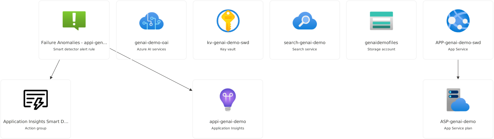

# Azure OpenAI Integration with ASP.NET Core

This project demonstrates how to integrate Azure OpenAI services with an ASP.NET Core web application. It includes endpoints for chat completion and image generation using Azure OpenAI.

# Azure OpenAI Integration with ASP.NET Core

This project demonstrates how to integrate Azure OpenAI services with an ASP.NET Core web application. It includes a combined endpoint for chat completion and image generation using Azure OpenAI.

## Azure Resources Used in MyChatApp Project



## Prerequisites

- [.NET 8.0 SDK](https://dotnet.microsoft.com/download/dotnet/8.0)
- Azure subscription with OpenAI and Azure AI Search services enabled
- In case you deploy you infrastructure using the Terraform available [HERE](https://github.com/aakaras/GenAIAzureInfra) the key vault configuration is handled for you.

#### Key Vault Configuration

Ensure your Azure Key Vault contains the following secrets:
- `AZURE-OPENAI-ENDPOINT`: Your Azure OpenAI Endpoint
- `AZURE-OPENAI-KEY`: Your Azure OpenAI API key
- `AZURE-SEARCH-ENDPOINT`: Your Azure Search Endpoint
- `AZURE-SEARCH-INDEX-NAME`: Your Azure Search Index name
- `SEARCH-KEY`: Your Azure Search key

## Setup

1. Clone the repository:
   ```sh
   git clone <repository-url>
   cd <repository-directory>
   ```

2. Restore the dependencies and run the application:
   ```sh
   dotnet restore
   dotnet run
   ```

## Endpoints

### Chat Completion

- **URL:** `/chat`
- **Method:** `POST`
- **Description:** Accepts a user message and returns a chat completion response.
- **Request Body:** Plain text containing the user's message.
- **Response:** Plain text containing the chat completion response.

### Image Generation

- **URL:** `/generate-image`
- **Method:** `POST`
- **Description:** Accepts a user prompt and returns a generated image URL.
- **Request Body:** Plain text containing the user's prompt.
- **Response:** Plain text containing the URL of the generated image.

## Code Overview

### 

Program.cs


- **Service Registration:**
  ```csharp
  builder.Services.AddSingleton(sp =>
  {
      AzureKeyCredential azureKeyCredential = new(apiKey);
      return new AzureOpenAIClient(new Uri(endpoint), azureKeyCredential);
  }
  ```

- **Chat Endpoint:**

The chat endpoint is available at /chat. It accepts a POST request with the user's message in the request body and returns the chat completion response.

Example usage:
```bash
curl -X POST http://localhost:5062/chat -d "Your message here"
```

  ```csharp
    app.MapPost("/chat", async (HttpContext context) =>
        {
            string userMessage = await new StreamReader(context.Request.Body).ReadToEndAsync();

            var client = context.RequestServices.GetRequiredService<AzureOpenAIClient>();
            var chatClient = client.GetChatClient("gpt-4o-mini-deployment"); // Replace with your desired deployment
            
        ChatCompletionOptions options = new();
        options.AddDataSource(new AzureSearchChatDataSource()
        {
            Endpoint = new Uri(searchEndpoint),
            IndexName = searchIndexName, // Use index name from Key Vault
            Authentication = DataSourceAuthentication.FromApiKey(searchKey) // Use search key from Key Vault
        });

        ChatCompletion completion = await chatClient.CompleteChatAsync(
            new List<ChatMessage>()
            {
                new UserChatMessage(userMessage)
            },
            options
        );

        AzureChatMessageContext onYourDataContext = completion.GetAzureMessageContext();

        string response = completion.Content[0].Text;
        if (onYourDataContext?.Intent is not null)
        {
            //response += $"\nIntent: {onYourDataContext.Intent}";
        }
        foreach (AzureChatCitation citation in onYourDataContext?.Citations ?? new List<AzureChatCitation>())
        {
            //response += $"\nCitation: {citation.Content}";
        }

        await context.Response.WriteAsync(response);
    });
    
  ```

- **Image Generation Endpoint:**

The image generation endpoint is available at /generate-image. It accepts a POST request with the user's prompt in the request body and returns the generated image URL.

Example usage:
```bash
curl -X POST http://localhost:5062/generate-image -d "Your image prompt here"
```

  ```csharp
    app.MapPost("/generate-image", async (HttpContext context) =>
        {
        string userPrompt = await new StreamReader(context.Request.Body).ReadToEndAsync();

        var client = context.RequestServices.GetRequiredService<AzureOpenAIClient>();
        var imageClient = client.GetImageClient("dall-e-3"); // Replace with your desired deployment

        // GenerateImageAsync now directly returns GeneratedImage (or throws an exception)
        try
        {
        GeneratedImage image = await imageClient.GenerateImageAsync(userPrompt, new()
        {
            Quality = GeneratedImageQuality.Standard,
            Size = GeneratedImageSize.W1024xH1024,
            ResponseFormat = GeneratedImageFormat.Uri
        });

        await context.Response.WriteAsync($"Image URL: {image.ImageUri}");
        }
        catch (Exception ex)
        {
            // Handle the exception, e.g., log the error and send an error response
            Console.WriteLine($"Image generation failed: {ex.Message}");
            await context.Response.WriteAsync("Image generation failed.");
        }
    });
  ```

## License

This project is licensed under the MIT License. See the LICENSE file for details.